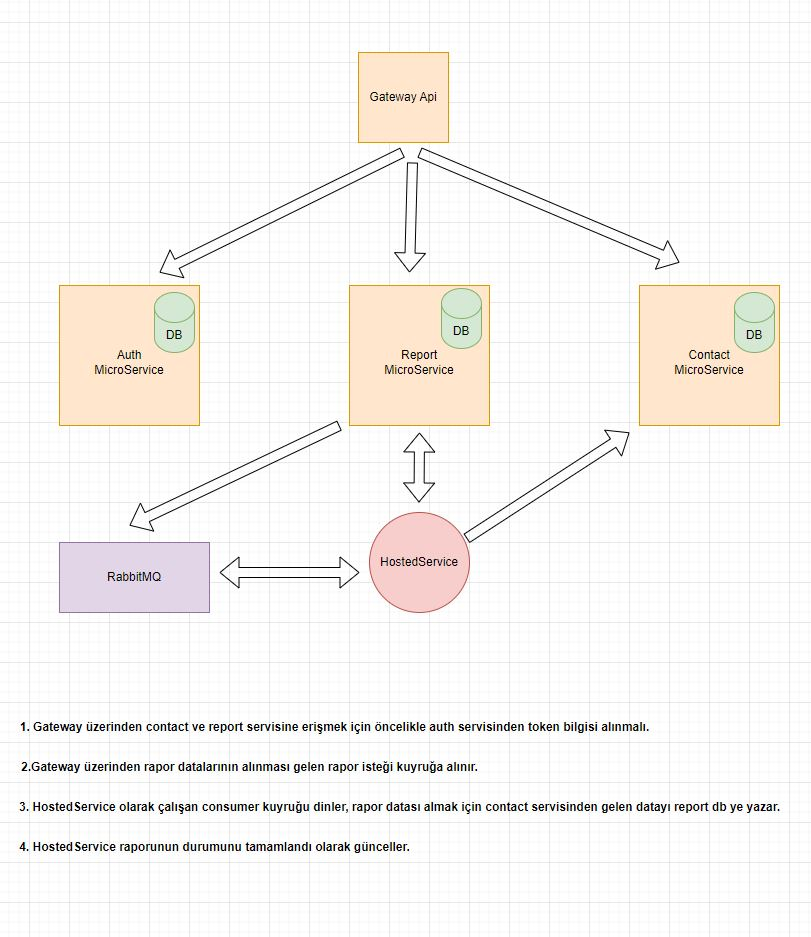

## Proje Hakkında

Birbirleri ile haberleşen minimum iki microservice'in olduğu bir yapı tasarlayarak, basit
bir telefon rehberi uygulaması oluşturulması sağlanacaktır.

Detaylı bilgilere aşağıdaki adres yolundan belirtilen pdf dosyasından ulaşabilirsiniz.

```
asset/Assessment.pdf
```

<h3><b>Çalışma Mimarisi</b></h2>

<p align="center">
  
</p>

<h3><b>Telefon Rehberi Projesinde Kullanılan Teknolojiler</b></h2>
<ul>
	<li>.NET Core 6</li>
	<li>Entity Framework Core 6</li>
	<li>Postgres</li>
	<li>RabbitMQ</li>
	<li>MassTransit</li>
	<li>HostedService</li>
	<li>Ocelot</li>
	<li>Swagger</li>
	<li>Health Check</li>
	<li>Logging</li>
	<li>Translations</li>
	<li>xUnit</li>
	<li>Moq</li>
	<li>Coverlet</li>
	<li>Docker</li>
</ul>

<h3><b>Telefon Rehberi Projesi Gereklilikler</b></h2>
<br>

Bilgisayarınızda RabbitMQ Postgres kurulu olmalıdır. Eğer değilse Docker kurulumu yapılarak aşağıdaki yol izlenebilir.

1.) Aşağıdaki adres üzerinden docker indirilip kurulmalıdır.

```
https://www.docker.com/products/docker-desktop/
```

<br>

2.) Docker üzerinde Postgres kurulumu için aşağıdaki komutu kullanabilirsiniz.

```
docker run --name postgresql -e POSTGRES_PASSWORD=rI1l9j!p7gO@ -p 5432:5432 -d postgres
```

<br>

3.) Docker üzerinde RabbitMQ kurulumu için aşağıdaki komutu kullanabilirsiniz.

```
docker run --name rabbitmq -d -p 15672:15672 -p 5672:5672 rabbitmq:3-management
```

<h3><b>Telefon Rehberi Projesinin Çalıştırılması</b></h2>

<br>

1.) Öncelikle aşağıdaki dizinlerde bulunan <b>appsettings.json</b> config ve path ayarlamalarını kendinize göre ayarlayınız.

```
src/Auth/API/appsettings.json
	-> Logging.Settings
	-> ConnectionStrings.PostgreSql

src/Contact/API/appsettings.json
	-> Logging.Settings
	-> ConnectionStrings.PostgreSql

src/Report/API/appsettings.json
	-> Logging.Settings
	-> ConnectionStrings.PostgreSql
	-> RabbitMQOptions

src/Gateway/API/appsettings.json
	-> Logging.Settings
```

<br>

2.) Bu işlemler yapıldıktan sonra aşağıdaki servisler çalıştırılarak tüm süreçler gateway api servisi üzerinden yapılabilir.

<br>

```
src/Auth/API
src/Contact/API
src/Report/API
src/Gateway/API
```

<br>

3.) Token Alma Bilgileri 

```
{
  "userName": "uzeyiroztemur@gmail.com",
  "password": "123456aA!"
}
```

<br>


4.) Postman testi içinde postman collection dosyaları eklenmiştir.


```
test/TelephoneDirectory.postman_collection.json
test/TelephoneDirectory.postman_environment.json
```

<br>


5.) Docker ile çalıştırmak için aşağıdaki komutları kullanabilirsiniz.

```
docker-compose build
docker-compose up
```

